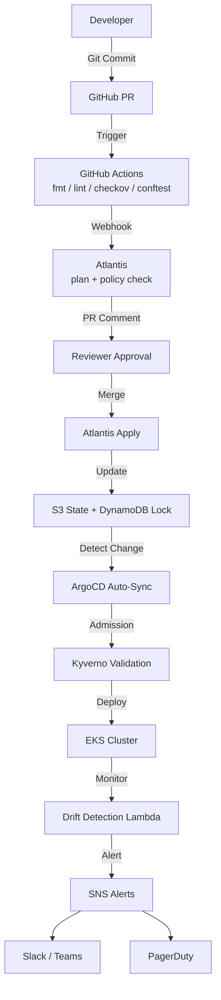
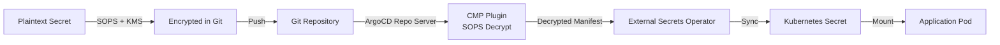
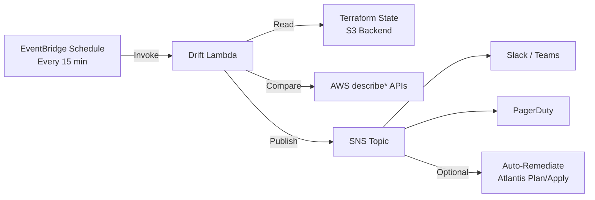

# GitOps-Only Infrastructure as Software

> **Zero manual changes. Full audit trail. Complete GitOps governance for regulated AWS environments.**

---

## What Is This Project

This project is a **complete, production-ready GitOps platform** that treats infrastructure as software rather than as a collection of manually configured cloud resources. It is a reference architecture for platform engineering teams who want to eliminate every form of manual infrastructure change — no AWS Console clicks, no ad-hoc `kubectl` commands, no secrets pasted into chat windows.

Built for **Amazon Web Services (AWS)**, the platform orchestrates infrastructure through **Terraform**, enforces review and policy through **Atlantis**, and continuously reconciles Kubernetes state through **ArgoCD**. Secrets are encrypted at rest in Git using **Mozilla SOPS** with **AWS KMS**, then decrypted automatically inside the cluster by a **Config Management Plugin (CMP)**. Every resource carries a Git commit SHA as a tag. Every change is logged for seven years. Every deviation from the declared state is detected within fifteen minutes.

This is not a tutorial or a proof-of-concept. It is a hardened, opinionated control plane designed for **Saudi enterprise cloud teams** — including regulated sectors such as banking, telecom, oil & gas, and government — where the Saudi Central Bank (SAMA) Cyber Security Framework mandates immutable audit trails, encryption at rest and in transit, and strict access controls.

---

## What Is It For

### Target Audience

- **Platform Engineering teams** building internal developer platforms
- **Site Reliability Engineers (SREs)** responsible for multi-environment uptime
- **Cloud Architects** designing landing zones for regulated enterprises
- **DevSecOps engineers** automating compliance and policy enforcement

### Use Cases

- **Multi-team infrastructure provisioning**: Onboard backend, data, and frontend teams to a shared EKS cluster with namespace isolation, resource quotas, and self-service GitOps workflows.
- **Compliance-heavy environments**: Pass SAMA, ISO 27001, and SOC 2 audits by proving that every AWS resource change originated from a Git commit, passed policy checks, and was applied through an automated pipeline.
- **Disaster recovery via Git revert**: When a deployment causes an outage, the fastest recovery path is `git revert` followed by an Atlantis apply — not frantic console navigation at 3 AM.
- **Audit-ready change tracking**: CloudTrail captures API calls, S3 Object Lock prevents log tampering, and Terraform state versioning preserves the exact configuration at any point in time.

### Problems It Solves

| Problem | How This Project Solves It |
|---------|---------------------------|
| Configuration drift | Drift detection Lambda compares Terraform state to live AWS resources every 15 minutes |
| Untracked manual changes | Kyverno blocks manual `kubectl create secret`; Atlantis locks prevent concurrent Terraform applies |
| Secret sprawl | SOPS + KMS encrypts secrets in Git; External Secrets Operator syncs them to clusters |
| Lack of rollback capability | ArgoCD selfHeal reverts manual K8s changes; automated Git revert Lambda handles staging sync failures |
| Compliance audit failures | CloudTrail + S3 Object Lock + 7-year retention provides immutable evidence for every change |

---

## Why To Use It

### Governance: Every Change Is a Git Commit

In this platform, the Git repository is the single source of truth. If a change is not in Git, it does not exist. Pull requests require human review. Atlantis posts the exact Terraform plan as a comment before any apply. ArgoCD continuously syncs the cluster to the desired state declared in Git. Full audit trail, blame, and revert capability are built in — not bolted on.

### Safety: Policy Engine Blocks Bad Changes Before They Reach AWS

Before Terraform applies any change, it must pass multiple policy gates:

- **Conftest** validates the Terraform plan against Rego policies (no public S3, encryption required, mandatory tags).
- **Checkov** scans for critical misconfigurations.
- **Kyverno** enforces Kubernetes admission rules (no manual secrets, required annotations, resource descriptions).
- **OPA** (optional) handles complex referential policies.

Bad changes are blocked in the PR, not in production.

### Consistency: Atlantis Ensures Reviewed Plans, ArgoCD Ensures Synced State

Atlantis guarantees that every `terraform apply` is preceded by a reviewed `terraform plan`. Plan files are persisted to a StatefulSet volume, so they survive pod restarts. ArgoCD guarantees that the Kubernetes cluster matches Git within minutes. Together, they eliminate the "it worked on my machine" problem for infrastructure.

### Secrets Management: SOPS + KMS + External Secrets Operator

Secrets live in Git, but they are encrypted with AWS KMS keys that differ per environment (dev vs. prod). The ArgoCD repo-server CMP decrypts them during sync. The External Secrets Operator reads from AWS Secrets Manager as a read-only cache. No plaintext secrets in Git. No manual `kubectl create secret`. No Vault server to operate.

### Drift Detection: Automated Lambda Detects Manual Console Changes

A Python Lambda function runs every 15 minutes via EventBridge. It downloads the Terraform state from S3, queries live AWS resources via `describe*` APIs, and reports discrepancies via SNS to Slack, Teams, or PagerDuty. Optional auto-remediation can trigger an Atlantis plan to reconcile the drift.

### Self-Healing: ArgoCD Auto-Sync Reverts Manual kubectl Changes

ArgoCD's `selfHeal: true` means that if an engineer runs `kubectl set image` or `kubectl edit deployment`, the change is automatically reverted within five minutes. The cluster state always matches Git.

### Documentation: Terraform State Auto-Generates Architecture Diagrams

Running `make docs-generate` invokes `terraform-docs` for every module and a custom Python parser that generates Mermaid diagrams from `terraform show -json`. Documentation never goes stale because it is regenerated from the actual state.

### SAMA Compliance: CloudTrail, S3 Object Lock, 7-Year Retention

The audit logging module provisions an organization-level CloudTrail trail, an S3 bucket with Object Lock in COMPLIANCE mode, cross-region replication, and Athena for ad-hoc queries. Every root account usage, IAM policy change, and KMS key deletion triggers a real-time SNS alert. This maps directly to SAMA Cyber Security Framework controls 3-1 through 3-7.

---

## Architecture Overview

### End-to-End GitOps Pipeline



### Secrets Encryption Flow



### Drift Detection Flow



---

## Directory Structure Explained

```
.
├── terraform/              # Infrastructure as Code (single source of truth)
│   ├── modules/            # Reusable, zero-hardcode modules
│   ├── environments/       # Per-environment tfvars overlays
│   ├── backend.tf          # S3 + DynamoDB remote state resources
│   └── main.tf             # Orchestrator with conditional flags
├── gitops/                 # GitOps manifests (ArgoCD, Atlantis, SOPS)
│   ├── argocd-apps/        # ArgoCD Applications and ApplicationSets
│   ├── atlantis/           # Repo config, workflows, plan requirements
│   ├── sops/               # Encrypted secrets and .sops.yaml rules
│   └── team-templates/     # Kustomize + Terraform templates for teams
├── kubernetes/             # Raw K8s manifests (not Helm-generated)
│   ├── atlantis/           # StatefulSet, ingress, RBAC
│   ├── external-secrets/   # ClusterSecretStore, ExternalSecret examples
│   ├── kyverno/            # Admission policies as code
│   └── argocd/             # CMP plugin, RBAC, notification templates
├── policies/               # The guardrails
│   ├── conftest/           # Rego policies for Terraform plans
│   └── opa/                # Complex referential Rego policies
├── scripts/                # Automation and operational scripts
│   ├── bootstrap-backend.sh
│   ├── pre-flight-checks.sh
│   ├── drift-detector.py
│   └── break-glass.sh
├── docs/                   # Auto-generated + runbooks
│   ├── architecture/       # Mermaid diagrams from Terraform state
│   ├── runbooks/           # Operational procedures
│   └── compliance/         # SAMA mapping, audit evidence
└── .github/workflows/      # CI validation before Atlantis runs
```

The `gitops/` directory is the **single source of truth** for cluster state. The `policies/` directory contains the **guardrails**. The `scripts/` directory contains the **automation** that makes the platform self-bootstrapping.

---

## Prerequisites

Before you begin, ensure you have the following tools installed and configured:

| Tool | Minimum Version | Purpose |
|------|----------------|---------|
| AWS CLI | 2.13+ | Interact with AWS APIs |
| Terraform | 1.7.0+ | Infrastructure provisioning |
| kubectl | 1.28+ | Kubernetes cluster interaction |
| Helm | 3.13+ | Package manager for Kubernetes |
| SOPS | 3.8+ | Encrypt secrets for Git |
| Conftest | 0.49+ | Policy validation for Terraform plans |
| Python | 3.11+ | Drift detection and docs generation scripts |

Optional but recommended:
- Atlantis CLI (for local workflow testing)
- GitHub CLI (`gh`) for webhook configuration
- tflint and checkov for local validation

### AWS Requirements

- An AWS account with IAM permissions to create:
  - VPC, subnets, NAT gateways, VPC endpoints
  - EKS clusters, managed node groups, IAM roles
  - S3 buckets with Object Lock, DynamoDB tables, KMS keys
  - CloudTrail trails, Lambda functions, EventBridge rules
- A GitHub organization with admin access for webhook configuration

---

## Quick Start

### Step 1: Clone the Repository

```bash
git clone https://github.com/my-org/gitops-platform.git
cd gitops-platform
```

### Step 2: Configure `terraform.tfvars`

Edit `terraform/terraform.tfvars` and fill in your values:

```hcl
project_name         = "my-platform"
environment          = "dev"
aws_region           = "eu-west-1"
git_commit_sha       = "$(git rev-parse --short HEAD)"
resource_description = "GitOps platform for regulated enterprise"

vpc_cidr = "10.0.0.0/16"
az_count = 3

github_org           = "my-org"
allowed_repositories = ["my-org/infrastructure", "my-org/gitops-apps"]
```

### Step 3: Run `make bootstrap`

```bash
make bootstrap
```

This idempotently creates:
- S3 bucket for Terraform state (versioning, encryption, public access block)
- DynamoDB table for state locking
- KMS key for state encryption

### Step 4: Deploy Base Infrastructure

For the **first deployment**, bootstrap the base infrastructure (VPC + EKS) before applying Kubernetes-dependent modules:

```bash
cd terraform
terraform init -backend-config="bucket=my-platform-terraform-state-..." \
  -backend-config="key=dev/terraform.tfstate" \
  -backend-config="region=eu-west-1" \
  -backend-config="dynamodb_table=my-platform-terraform-locks"

# First time only: create networking and EKS cluster
make bootstrap-infra

# After EKS is ready, deploy ArgoCD, Atlantis, and all platform modules
make bootstrap-platform
```

For subsequent updates, use:
```bash
make plan
make apply
```

### Step 5: Configure GitHub Webhook for Atlantis

In your GitHub repository settings, add a webhook:
- **Payload URL**: `https://atlantis.my-platform.dev.example.com/events`
- **Content type**: `application/json`
- **Secret**: The value stored in AWS Secrets Manager (`atlantis/webhook-secret`)
- **Events**: Pull requests, Pushes

### Step 6: Encrypt a Secret with SOPS

```bash
sops --encrypt --in-place gitops/sops/secrets/dev/db-credentials.yaml
git add gitops/sops/secrets/dev/db-credentials.enc.yaml
git commit -m "feat: add encrypted dev db credentials"
git push
```

### Step 7: Create a Test PR

Modify any Terraform file (e.g., add a tag), open a PR, and watch Atlantis post the plan as a comment.

### Step 8: Merge and Watch ArgoCD Sync

Merge the PR. Atlantis applies the Terraform change. ArgoCD detects the new commit and auto-syncs any Kubernetes changes.

### Step 9: Verify No Drift

```bash
make drift-check
```

---

## Atlantis Workflow Deep Dive

### Configuration Files

- `gitops/atlantis/atlantis.yaml` — Project-level config defining directories, workspaces, and workflow assignments.
- `gitops/atlantis/repo-config.yaml` — Repo-level config defining allowed repositories, branch regexes, and plan/apply requirements.
- `gitops/atlantis/workflows/default.yaml` — Dev workflow: init → plan → conftest → apply.
- `gitops/atlantis/workflows/strict.yaml` — Prod workflow: init → plan → conftest → checkov → approval → apply.

### Plan Requirements vs Apply Requirements

| Environment | Plan Requirements | Apply Requirements |
|-------------|-------------------|-------------------|
| dev | approved | approved, mergeable |
| staging | approved | approved, mergeable |
| prod | approved, mergeable | approved, mergeable, undiverged |

### Custom Workflow

```yaml
plan:
  steps:
    - init
    - plan:
        extra_args: ["-lock=true", "-out=$PLANFILE"]
    - run: conftest test $PLANFILE --policy ../policies/conftest/terraform
    - run: checkov -f $PLANFILE --framework terraform_plan
apply:
  steps:
    - apply:
        extra_args: ["$PLANFILE"]
```

### Example PR Comment

```
Ran Plan for dir: terraform workspace: default

Plan: 3 to add, 0 to change, 0 to destroy.

Policy Check Results:
✔ no_public_s3      - 3 passed
✔ encryption_required - 3 passed
✔ required_tags     - 3 passed

Checkov Scan:
✔ No critical misconfigurations found
```

---

## ArgoCD Self-Management Explained

### How ArgoCD Manages Itself

An ArgoCD Application named `argocd` points to the `gitops/argocd/` directory in this repository. Any change to ArgoCD's RBAC, CMP, or notification config is deployed by ArgoCD itself. This is the "self-hosted" or "self-managed" pattern.

### ApplicationSet for Team Onboarding

ApplicationSets use Git generators to scan team repositories for `*/overlays/{dev,staging,prod}` directories. When a team adds a new service folder, ArgoCD automatically creates an Application without manual intervention.

### CMP Plugin for SOPS Decryption

The Config Management Plugin runs an init container that downloads SOPS. During sync, the plugin decrypts any `*.enc.yaml` files before Helm or Kustomize processes them. This means teams can commit encrypted secrets directly to their app repos.

### Sync Waves and Hooks

- **Pre-sync validation**: A Job can run schema validation before the main sync.
- **Post-sync notification**: ArgoCD notifications send Slack/Teams messages after sync completion or failure.
- **Sync waves**: Infrastructure (namespaces, CRDs) deploys in wave -1, apps in wave 0, jobs in wave 1.

---

## Secrets Strategy

### Why SOPS + KMS Instead of Sealed Secrets or Vault?

- **Git-native**: Secrets are versioned, diffed, and reviewed like any other code.
- **No extra server**: No Vault cluster to operate, upgrade, or HA-provision.
- **AWS KMS integration**: Key policies, rotation, and audit logs are managed by AWS.
- **Team-friendly**: Developers already know Git; they do not need to learn another CLI.

### `.sops.yaml` Creation Rules

```yaml
creation_rules:
  - path_regex: secrets/dev/.*\.enc\.yaml$
    kms: arn:aws:kms:eu-west-1:123456789012:key/DEV-KEY
    encrypted_regex: ^(data|stringData)$

  - path_regex: secrets/prod/.*\.enc\.yaml$
    kms: arn:aws:kms:eu-west-1:123456789012:key/PROD-KEY
    encrypted_regex: ^(data|stringData)$
```

Dev and prod use **different KMS keys**. The prod key has stricter IAM policies.

### External Secrets Operator as Read-Only Cache

AWS Secrets Manager is the source of truth. ESO polls every hour and creates Kubernetes Secrets. If a K8s Secret is deleted, ESO recreates it. If the AWS secret is rotated, ESO updates the K8s Secret within the refresh interval.

### Break-Glass Secret Rotation

In an emergency, run:

```bash
make break-glass -- --reason="Emergency cert rotation" --user="alice" --approver="bob"
# Rotate the secret in AWS Secrets Manager
# ESO will sync it to the cluster within 1 hour (or restart ESO pod for immediate sync)
```

---

## Policy as Code Catalog

### Conftest Policies (Terraform Plans)

| Policy Name | What It Blocks | Severity | Example Violation |
|-------------|---------------|----------|-------------------|
| `no_public_s3.rego` | Public S3 ACLs or policies | Critical | `acl = "public-read"` |
| `encryption_required.rego` | Unencrypted EBS, RDS, S3 | Critical | `encrypted = false` on EBS |
| `required_tags.rego` | Missing mandatory tags | High | No `CostCenter` tag |
| `mandatory_annotations.rego` | Missing K8s annotations | Medium | No `description` on manifest |
| `deny_root_account.rego` | Root account in IAM policy | Critical | `Principal = "*"` |

### Kyverno Policies (Kubernetes Admission)

| Policy Name | What It Blocks | Scope | Exception Process |
|-------------|---------------|-------|-------------------|
| `require-gitops-annotations` | Resources without ArgoCD tracking ID | All namespaces (except system) | Add annotation or request exclusion via PR |
| `block-manual-secrets` | `kubectl create secret` | All namespaces (except external-secrets) | Use ExternalSecret or SOPS manifest |
| `enforce-resource-descriptions` | `metadata.annotations.description < 10 chars` | Deployments, Services, ConfigMaps | Fix annotation length |

### Adding a New Policy

**Conftest (Terraform)**:
1. Create `policies/conftest/terraform/my_policy.rego`
2. Write a `deny[msg]` rule using the `input.resource_changes` structure
3. Run `conftest test tfplan.json --policy policies/conftest/terraform`

**Kyverno (Kubernetes)**:
1. Create `kubernetes/kyverno/policies/my-policy.yaml`
2. Define `validationFailureAction: Enforce` or `Audit`
3. ArgoCD will auto-sync it to the cluster

---

## Drift Detection & Remediation

### How the Lambda Works

The drift detection Lambda (`scripts/drift-detector.py`) runs on an EventBridge schedule:
1. Downloads the Terraform state from the S3 backend
2. Extracts resource attributes from the state JSON
3. Queries live AWS resources via Boto3 (`describe_instances`, `describe_security_groups`, etc.)
4. Compares state to live resources for EC2, Security Groups, IAM, S3, RDS, and Route53
5. Publishes findings to SNS

### Reading Drift Alerts

A typical alert looks like:

```json
{
  "environment": "prod",
  "drift_count": 2,
  "drift_items": [
    {
      "resource": "aws_instance.bastion",
      "type": "ec2",
      "drift_type": "MISSING",
      "detail": "EC2 instance i-0abc123 exists in state but not in AWS"
    }
  ]
}
```

### Auto-Remediation vs Manual Remediation

```
Drift Detected
    |
    v
Is auto_remediate enabled? ----Yes----> Trigger Atlantis plan/apply via API
    |
    No
    v
Alert to Slack/Teams/PagerDuty
    |
    v
Engineer investigates (drift-remediation.md runbook)
```

### Investigation Runbook

1. Run `make drift-check` to reproduce
2. Check CloudTrail for who/what deleted/modified the resource
3. If accidental deletion: `terraform import <address> <id>` then `make apply`
4. If intentional but undocumented: Add the change to Terraform and apply
5. If malicious: Initiate incident response, rotate credentials, review CloudTrail

---

## Rollback Mechanics

### Git Revert for Terraform

The fastest rollback for infrastructure is Git revert:

```bash
git revert <bad-commit>
git push origin main
# Atlantis will plan the revert on the next PR
```

### ArgoCD selfHeal for Kubernetes

ArgoCD's automated sync with `selfHeal: true` detects any manual change to a managed resource and reverts it within the sync interval (typically 3–5 minutes).

### Automated Lambda Revert for Staging

When ArgoCD reports a sync failure to SNS, the rollback Lambda:
1. Receives the SNS event
2. Calls the GitHub API to revert the commit that caused the failure
3. Creates a PagerDuty incident with commit details
4. Only operates automatically on `staging`; `prod` requires manual Slack approval

### When NOT to Auto-Revert

- **Database migrations**: Reverting a migration job may leave the schema in an inconsistent state
- **Stateful services**: Persistent volume changes cannot always be safely reverted
- **CRD upgrades**: Reverting a CRD may break existing custom resources

In these cases, disable auto-sync temporarily and perform a manual coordinated rollback.

---

## Auto-Generated Documentation

### How `make docs-generate` Works

1. **terraform-docs**: Scans every module in `terraform/modules/` and generates markdown tables of inputs, outputs, and resources.
2. **Python parser**: Runs `terraform show -json`, parses the resource graph, and outputs Mermaid diagrams.
3. **Injection**: Diagrams and tables are written to `docs/architecture/` with a timestamp.

### Where Mermaid Diagrams Are Saved

- `docs/architecture/network-topology.md` — VPC, subnets, NAT gateways, endpoints
- `docs/architecture/resource-dependencies.md` — Terraform resource dependency graph
- `docs/architecture/iam-trust.md` — IRSA trust relationships and role assumptions

### Annotating Resources for Docs

Every Terraform resource should include:

```hcl
tags = merge(var.common_tags, {
  Description = var.resource_description
  GitCommit   = var.git_commit_sha
})
```

The docs generator uses the `Description` tag to annotate diagrams.

---

## Cost Optimization

### Spot Instances for Workloads

The EKS `workloads` managed node group uses `capacity_type = "SPOT"` by default. System pods run on on-demand `system` nodes for stability.

### S3 Intelligent-Tiering

Terraform state buckets and audit log buckets use lifecycle policies to transition objects to Glacier after 90 days. The state bucket itself remains in Standard for fast `terraform init`.

### Lambda Reserved Concurrency

Drift detection Lambda uses reserved concurrency (default: 5) to prevent runaway costs if EventBridge schedules overlap.

### Estimated Monthly Cost Breakdown (eu-west-1)

| Environment | EKS | NAT GWs | Atlantis | ArgoCD | Total (est.) |
|-------------|-----|---------|----------|--------|--------------|
| dev | $150 | $100 | $50 | $30 | ~$330 |
| staging | $200 | $150 | $50 | $30 | ~$430 |
| prod | $400 | $300 | $100 | $50 | ~$850 |

*Excludes workload-specific compute and data transfer.*

---

## Troubleshooting

### Atlantis Plan Fails

| Symptom | Cause | Fix |
|---------|-------|-----|
| `Error acquiring the state lock` | Stale DynamoDB lock | `terraform force-unlock <ID>` |
| `module not found` | Wrong module path in PR | Ensure module source path is correct |
| `webhook not received` | GitHub webhook misconfigured | Verify payload URL and secret in repo settings |

### ArgoCD Sync Stuck

| Symptom | Cause | Fix |
|---------|-------|-----|
| `ComparisonError` | SOPS decryption failure | Check KMS key policy and CMP init container logs |
| `Unknown` | CMP plugin error | Check repo-server logs for SOPS/Helm errors |
| `SyncFailed` | Network policy blocking repo-server | Allow repo-server egress to GitHub and KMS |

### Conftest Policy Failure

1. Run `conftest test tfplan.json --policy policies/conftest/terraform -o json` for detailed output
2. Debug the Rego policy with `conftest parse tfplan.json`
3. Request a policy exception via PR to `policies/conftest/terraform/`

### Drift Detection False Positives

- **Expected**: Resources replaced by AWS auto-recovery (e.g., failed EC2 instance)
- **Mitigation**: Add the new resource ID to Terraform via `terraform import`

### SOPS Decryption Failure

- Verify KMS key permissions (Atlantis IRSA role must have `kms:Decrypt`)
- Check `.sops.yaml` matches the file path regex
- Ensure the `encrypted_regex` covers the correct YAML keys

### Terraform State Lock Timeout

- Check DynamoDB table metrics for throttling
- If a stale lock exists, use `terraform force-unlock <LOCK_ID>`
- Ensure no concurrent CI jobs are running `terraform plan`

### Kyverno Blocking ArgoCD

Add an exception for the ArgoCD service account:

```yaml
exclude:
  resources:
    namespaces:
      - argocd
```

Or add a `clusterRoles` exclusion for the `argocd-application-controller` service account.

---

## Break-Glass Procedures

### When Manual AWS Console Access Is Justified

- Production outage where Terraform provider has a known bug
- Emergency IAM changes to revoke compromised credentials
- AWS support-directed changes that cannot be expressed in Terraform HCL

### 4-Eyes Approval Process

1. **Requestor** posts in `#incidents` with:
   - Severity (P1/P2)
   - Expected resources to modify
   - Estimated time window
2. **Approver** (platform admin) responds with explicit approval
3. Both run `make break-glass` to log the approval

### Logging

All break-glass actions are logged to:
- CloudTrail (AWS API calls)
- CloudWatch Logs (`/aws/platform/break-glass`)
- Slack `#incidents` thread
- PagerDuty incident (if production)

### Post-Incident Reconciliation

Within 24 hours of break-glass access:
1. Run `terraform plan` to identify differences
2. Use `terraform import` for any manually created resources
3. Apply Terraform to restore Git as the source of truth
4. Update runbooks if the scenario should be automated in the future

---

## SAMA Compliance Mapping

| SAMA Control | Platform Component | Evidence Location |
|-------------|-------------------|-------------------|
| 3-1-1 Governance | Git + Atlantis | Git commit history, PR approvals |
| 3-2-1 Risk Assessment | Checkov + Conftest | `.github/workflows/terraform-validation.yml` |
| 3-3-1 Operations | ArgoCD self-healing | `gitops/argocd-apps/self-management/` |
| 3-4-1 Access Control | IRSA + Atlantis locks | `terraform/modules/eks_gitops/`, `terraform/modules/atlantis/` |
| 3-5-1 Asset Inventory | Required tags policy | `policies/conftest/terraform/required_tags.rego` |
| 3-6-1 Data Encryption | SOPS + KMS | `gitops/sops/.sops.yaml`, `terraform/modules/secrets_sops/` |
| 3-7-1 Cloud Security | Private EKS, VPC Flow Logs | `terraform/modules/eks_gitops/`, `terraform/modules/networking/` |

Full mapping and evidence queries are in `docs/compliance/sama-mapping.md`.

---

## Team Onboarding

### Adding a New Team to the Platform

1. **Add team to `terraform.tfvars`**:
   ```hcl
   teams_list = ["backend", "data", "my-new-team"]
   source_repositories = {
     my-new-team = ["https://github.com/my-org/my-new-team"]
   }
   ```

2. **Run Terraform**:
   ```bash
   make plan
   make apply
   ```

3. **Grant SOPS key access**:
   Update KMS key policy to allow the new team's CI role.

4. **Verify in ArgoCD**:
   The new ApplicationSet and AppProject will appear automatically.

### New Developer Checklist

- [ ] Git hooks installed (`pre-commit install`)
- [ ] Atlantis permissions granted (GitHub team membership)
- [ ] ArgoCD project access configured (RBAC ConfigMap)
- [ ] SOPS key access provisioned (KMS key policy)

### Template Customization Guide

Teams can fork `gitops/team-templates/standard-service/` and customize:
- `deployment.yaml` — container image, resource limits, health checks
- `service.yaml` — port configuration, annotations
- `kustomization.yaml` — image tags, common labels, configmap generators

---

## Roadmap

| Quarter | Initiative | Status |
|---------|-----------|--------|
| Q1 2025 | Terraform Cloud/Enterprise integration | Planned |
| Q2 2025 | Crossplane for multi-cloud GitOps | Planned |
| Q2 2025 | Sentinel policy-as-code (HashiCorp) | Planned |
| Q3 2025 | Automated cost anomaly detection in CI | Planned |
| Q3 2025 | GitOps for databases (SchemaHero/Liquibase) | Planned |
| Q4 2025 | AI-assisted drift explanation | Research |

The Terraform Cloud migration path is designed to be non-disruptive. Because all state is already in S3 with DynamoDB locking, migrating to Terraform Cloud simply requires updating the `backend` configuration block and re-running `terraform init`. The Atlantis integration supports Terraform Cloud/Enterprise as a backend provider with minimal configuration changes.

Crossplane integration will allow the platform to manage resources across AWS, Azure, and GCP using the same GitOps workflow. Teams will define crossplane composite resources in Git, and ArgoCD will sync them to a Crossplane control plane running inside EKS. This extends the "Infrastructure as Software" discipline from AWS-only to true multi-cloud governance without changing the developer experience.

---

## License

MIT License — See `LICENSE` for details.

## Contributing

All contributions must pass:
1. `terraform fmt`
2. `tflint`
3. `checkov`
4. `conftest test`
5. Peer review via Atlantis

No manual changes to production. Ever.
